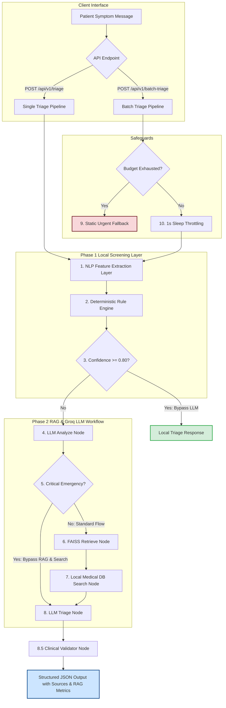
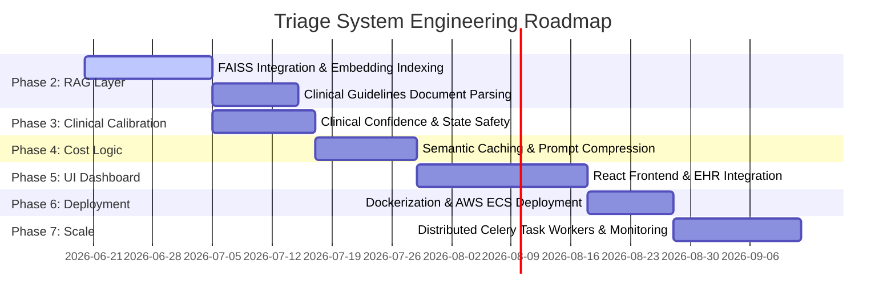

# 🩺 Symptom Triage Agent

An advanced, production-grade clinical symptom triage screening API built with **FastAPI**, **LangGraph**, **Pydantic v2**, and **Groq LLM**. 

This system is designed as a secure, fast, and highly reliable patient symptom screening service. It evaluates symptom descriptions, determines clinical urgency, identifies suspected medical conditions, extracts red flag warnings, generates standardized clinical disclaimers, and outputs structured, validated JSON payloads.

---

## 📖 Project Evolution: From Interview MVP to Production Hybrid Engine

The system has evolved from a simple, direct-to-LLM prototype to a resilient, high-throughput, rule-assisted hybrid architecture designed to handle production workloads with clinical safety, cost efficiency, and API rate-limit protection.

### ⏱️ Phase 0: Interview MVP
The original challenge was to construct an Agentic Clinical Triage System within a 60-minute constraint.

*   **Input**: Raw patient symptom text messages.
*   **Output**: Structured json containing `urgency`, `condition`, `red_flags`, `confidence`, and `disclaimer`.
*   **Initial MVP Workflow**:
    ```text
    Patient Message ──> Groq LLM (Analyze Node) ──> LangGraph Routing ──> Groq LLM (Triage Node) ──> Structured Output
    ```
*   **Identified Failure Modes**:
    1.  **Heavy LLM Dependency**: Every patient description required running the complete LLM flow.
    2.  **API Rate Limiting**: Sending 100 cases in a batch triggered `HTTP 429 Too Many Requests` due to Groq's low RPM/TPM thresholds.
    3.  **High API Costs**: Each standard patient triage required 2 distinct LLM calls (one for analysis, one for final generation).
    4.  **Inefficient Latency**: Zero caching or deterministic short-circuits meant simple cases (like a paper cut) took several seconds.

---

### 🚀 Phase 1: Hybrid Triage Engine
To address the MVP weaknesses, a **Rule-First Hybrid Engine** was developed. This layer optimizes clinical safety, guarantees response reliability, and slashes API execution costs.

#### 1. NLP Feature Extraction Layer (`app/services/nlp_processor.py`)
A local, lightweight parser matches keywords and regular expressions to extract structured clinical features:
*   **Symptoms**: Scanned against a predefined list (`SYMPTOMS_LIST`).
*   **Severity**: Identifies `mild`, `moderate`, `severe`, or `unbearable`.
*   **Duration**: Parses time windows using regular expressions (e.g., "for 2 hours", "3 days").
*   **Body Parts**: Matches anatomical regions (`chest`, `head`, `stomach`, etc.).
*   **Emergency Indicators**: Scans for acute warnings (`loss of consciousness`, `unable to breathe`, `severe bleeding`, etc.).
*   **Age Reference**: Parses demographic context (e.g., "5-year-old", "elderly").

### Data Flow Diagram


*Example Input & Output:*
```text
"I have severe chest pain for 2 hours"
```
```json
{
  "symptoms": ["chest pain"],
  "severity": "severe",
  "duration": "2 hours",
  "body_parts": ["chest"],
  "emergency_indicators": [],
  "age_reference": null
}
```

#### 2. Medical Rule Engine (`app/services/rule_engine.py`)
Processes extracted features against standard clinical rule configurations (`SYMPTOM_RULES`). It supports **severity elevation**—automatically shifting a symptom's urgency level higher if the severity is flagged as `severe` or `unbearable`.

*Predefined rules include*:
*   **Chest Pain**: Urgency = `Emergency`, Suspected Condition = `Potential Acute Coronary Syndrome`, Confidence = `0.95`.
*   **Headache**: Urgency = `Non-Urgent`, Suspected Condition = `Tension-type Headache`, Confidence = `0.85`.
*   **Abdominal Pain**: Urgency = `Urgent`, Suspected Condition = `Acute Abdominal Inflammation`, Confidence = `0.85`.
*   **Shortness of Breath**: Urgency = `Emergency`, Suspected Condition = `Acute Respiratory Distress`, Confidence = `0.95`.

#### 3. Local Triage Bypass
If the Rule Engine yields a match with a confidence score greater than or equal to the configurable threshold (default `0.80`), it bypasses the LLM entirely:
```text
Patient Message ──> NLP Features ──> Rule Engine ──> Confidence >= 0.80? ──(Yes)──> Deterministic Response (Bypasses LLM)
```
This bypass operates in $< 5\text{ms}$ and incurs **zero API cost**.

#### 4. Emergency Detection Layer
Added a dedicated safety check (`EMERGENCY_KEYWORDS`). If critical indicators (e.g., *chest pain*, *stroke*, *anaphylaxis*, *severe bleeding*) are detected during the LLM node traversal, the system forces `is_critical=True`, routes directly to the final triage node (bypassing the reference DB search and RAG lookup), and ensures the output is flagged as `Emergency` urgency.

#### 5. Cost & Rate-Limit Protections
*   **Singleton ChatGroq Client**: Instantiated once and shared across nodes.
*   **Request Throttling**: Imposes a `sleep(1)` before every live Groq call.
*   **LLM Budget Cap**: Sets `BATCH_MAX_LLM_CASES=15`. During a batch run, the LLM is called a maximum of 15 times. Subsequent cases fallback to a structured fallback response.
*   **Standardized Fallback**: If the budget is exhausted, the system returns a safe, structured assessment: `Urgency: Urgent`, `Condition: Needs Clinical Review`, `Confidence: 0.50`, with a clinical safety warning.

#### 6. Batch processing Endpoint
A new `/api/v1/batch-triage` endpoint fetches a cohort of 100 cases, processes them through the hybrid optimization layer, and returns detailed metrics.

---

### 🧠 Phase 2: RAG + FAISS Integration

To reduce LLM hallucinations, increase clinical explainability, and ground triage recommendations in clinical guidelines, a Retrieval-Augmented Generation (RAG) layer was implemented using local FAISS vector stores.

#### 1. Decoupled Retriever Architecture (`BaseRetriever`)
To allow future hot-swaps to alternate vector databases (e.g. Chroma, Pinecone, Qdrant, Weaviate) without modifying LangGraph workflow nodes, the retrieval system is structured using an abstract interface:
*   `BaseRetriever`: Abstract parent class requiring a concrete implementation of `retrieve(query, top_k)`.
*   `FAISSRetriever`: Concrete subclass utilizing a local FAISS index and HuggingFace Embeddings.

#### 2. Multi-PDF Document Ingestion & Chunking Strategy by Document Type
The retriever automatically loads all `.pdf` clinical guidelines and case documents located under `app/resources/medical_docs/` (e.g. `api_cases.pdf` or folders like `emergency/`, `chronic/`, `pregnancy/`, `pediatrics/`, and `miscellaneous/`).
*   **Chunking Strategy by Document Type**:
    *   **Guideline documents** (folders: `emergency`, `chronic`, `pregnancy`, `pediatrics`, `miscellaneous`): pages are split into larger chunks (`chunk_size = 1200`, `chunk_overlap = 200`) to preserve clinical context.
    *   **Case documents** (file: `api_cases.pdf`): split into smaller chunks (`chunk_size = 400`, `chunk_overlap = 50`) for narrow factual lookups.
*   **Local Vectorization**: Uses `sentence-transformers/all-MiniLM-L6-v2` to vectorize text chunks locally.

> [!WARNING]
> **First-Time Initialization Notice**: On the very first run (or if model caches are empty), initializing `HuggingFaceEmbeddings` will download the `sentence-transformers/all-MiniLM-L6-v2` model weights (~90MB). This can take **2 to 5 minutes** depending on network speed. This delay only happens once. Later startups usually take **2 to 15 seconds** depending on hardware.

#### 3. Expanded Retrieval Candidate Pool & Metadata-Aware Boosting
To improve recall for chronic and non-obvious symptom queries:
*   **Candidate Pool Expansion**: The retriever queries the vector store for `INITIAL_RETRIEVAL_K = 8` candidates.
*   **Metadata-Aware Boosting**: Scores are dynamically adjusted prior to filtering:
    *   *Guideline documents* (emergency, chronic, pregnancy, pediatrics, miscellaneous) are boosted: `adjusted_score = raw_score * 1.15`
    *   *Case documents* (case) are slightly penalized: `adjusted_score = raw_score * 0.90`
*   **Threshold Relaxation Fallback**:
    *   Surviving chunks are filtered against `MIN_RELEVANCE_SCORE = 0.25` on their adjusted score.
    *   If no chunks survive, the retriever retries once with a relaxed threshold of `RELAXED_MIN_RELEVANCE = 0.15` to avoid zero-chunk retrieval for valid medical queries.
*   **Ranking & Cap**: The final context includes up to `FINAL_TOP_K` chunks (configured via `RAG_TOP_K`, default `3`) sorted by adjusted score in descending order.

#### 4. Metadata-Aware Retrieval
During chunk ingestion, rich metadata is tagged onto each vector chunk:
```json
{
  "source": "stroke.pdf",
  "page": 14,
  "document_type": "emergency"
}
```
This enables granular filtering and clear auditability of sources across folders.

#### 5. Persisted Index Startup (Startup Persistence)
To avoid rebuilding the vector store on every startup, the system checks for the FAISS index files (`index.faiss` and `index.pkl`) inside `app/resources/vector_store/`:
*   *If present*: The server loads the index into memory in $\sim 2–15\text{ seconds}$ depending on model cache and hardware.
*   *If missing*: The index is built from scratch recursively and persisted.

#### 6. Capped Context Injection (`MAX_CONTEXT_CHARS=2000`)
To prevent prompt size explosion, high API latency, and rate limit exhaustion, the retrieved context injected into the final triage prompt is truncated to a maximum of `2000` characters.

#### 7. Configurable retrieval (`RAG_TOP_K`)
The number of retrieved chunks can be configured dynamically via the environment variable `RAG_TOP_K` (defaults to `3`).

#### 8. Source Attribution & Metrics
For every LLM triage request, the API response includes a detailed sources list and performance metrics:
*   `sources`: List of matching references including `source`, `page`, `document_type`, and similarity `score` (redundant `document` field is removed).
*   `rag_used`: Indicates if RAG was run (strictly `True` if `retrieved_chunks > 0`, else `False`).
*   `retrieval_latency_ms`: Duration of vector query.
*   `retrieved_chunks`: Count of chunks meeting the threshold.

#### 9. Local Bypass Integrity Safeguard
If a patient message matches a local rule ($\ge 0.80$ confidence), the local triage router bypasses **all** downstream nodes (retrieval, database search, and Groq). FAISS is **never** queried for local bypasses, maintaining the baseline $1\text{ms}$ execution latency.

---

### 🛡️ Phase 2.5: Clinical Safety Hardening Layer

To prepare the Symptom Triage Agent for production and ensure clinical safety, a rigorous hardening pass was implemented to resolve over-triage, enforce legal warnings, and govern multi-rule override behaviors:

#### 1. Removed Over-Aggressive Emergency Keyword Bypass
Previously, raw keywords like `"chest pain"` and `"shortness of breath"` immediately bypassed RAG, search, and LLM triage nodes by forcing `is_critical = True`. This caused low-risk symptoms (e.g., "mild chest pain after exercise") to bypass clinical safety evaluations. 
*   **Fix**: Removed `"chest pain"` and `"shortness of breath"` from `EMERGENCY_KEYWORDS`. Only true immediate life-threatening events (e.g., `"stroke"`, `"seizure"`, `"anaphylaxis"`, `"unable to breathe"`, `"loss of consciousness"`, `"severe bleeding"`) trigger the immediate bypass. 
*   **Result**: Low-risk inputs now proceed through `retrieve_node` ➔ `search_node` ➔ `triage_node` for complete clinical grounding.

#### 2. Enforced Legal Disclaimer Inside `triage_node`
To mitigate LLM hallucination risks or accidental omission of safety guidelines, `triage_node` now guarantees that a standardized legal warning prefix is prepended to the final response disclaimer regardless of LLM generation behavior.
*   **Legal Prefix**: `"This system is an AI-assisted symptom triage support tool and not a medical diagnosis system. It cannot replace physician evaluation, emergency services, or clinical judgment."`
*   **Implementation**: Prepend and format: `final_disclaimer = f"{LEGAL_DISCLAIMER} {assessment.disclaimer}"` on success, and enforce a robust fallback prefix if an internal generation exception is handled.

#### 3. Neutral Low-Risk Chest Pain Labeling
Auto-emergency classification of chest pain without severe secondary signs can cause clinical workflow congestion.
*   **Fix**: Single-symptom chest pain without high-risk triggers (e.g., sweating, arm pain, dizziness, or shortness of breath) is classified as **Urgent** and assigned the neutral condition label: `"Chest Pain Requiring Medical Evaluation"`.
*   **High-Risk Chest Pain**: Still triggers a priority-100 emergency flag with `"Potential Acute Coronary Syndrome (Heart Attack)"` if matching combination rules or validator overlays.

#### 4. Priority-Based Validator Override System
In multi-symptom or complex clinical inputs, sequential validators could overwrite severe conditions with milder ones based solely on rule execution order (last-rule-wins behavior).
*   **Fix**: Implemented a global priority map (`RISK_PRIORITY`) and a validation helper `apply_override(priority, urgency, condition, red_flags)`. 
*   **Logic**: Overwrite existing classifications only if the new condition priority is strictly greater than the current active priority (with ties preserving the first detected condition).
*   **Priority Hierarchy**:
    *   **Priority 100**: Myocardial Infarction (MI), Acute Stroke
    *   **Priority 95**: Pulmonary Embolism (PE), Acute Seizure
    *   **Priority 90**: Sepsis, Meningitis, Altered Mental Status in Elderly, Hypoxia / Respiratory Emergency
    *   **Priority 85**: Pregnancy Emergency, GI Bleed
    *   **Priority 80**: Pediatric Dehydration Emergency
    *   **Priority 70**: Pediatric Fever / Febrile Child
    *   **Priority 60**: Low Confidence Guardrail

#### 5. Red Flags Semantic Deduplication
Merging LLM-generated red flags with predefined rule engine triggers introduces semantic duplicates (e.g., `"Profuse sweating"` alongside `"Profuse sweating (diaphoresis)"`).
*   **Fix**: Added a dedicated `normalize_red_flags(flags)` helper to normalize casing, remove medical jargon synonyms like `(diaphoresis)`, and strip redundant spaces to produce a clean, unique list of warnings in the final payload.

#### 6. Observability Structured Logging
Transitioned safety logging inside `validator_node` from general standard console prints to structured JSON-like `logger.info` dictionaries. This guarantees seamless ingestion and indexing across log aggregators and APM platforms (e.g., Datadog, Grafana, ELK).

#### 7. Audit Trails for Emergency Bypass
Previously, keyword-triggered emergencies bypassed the LLM/RAG pipeline without updating trace properties.
*   **Fix**: Modified `analyze_node` to output the exact matching keyword triggers inside the `escalation_reason` field. This is fully propagated through the graph state to the final client schema payload.

#### 8. PE Logic Ordering Resolution
Corrected the execution flow of Pulmonary Embolism (PE) validators by checking the most specific three-symptom configuration (`chest pain` + `shortness of breath` + `dizziness`) first. This prevents the less-specific two-symptom check from blocking more specific clinical evaluations.

---

## 🏗️ System Architecture & Data Flow

The triage logic is compiled as a LangGraph `StateGraph` state machine.

### Flowchart


---

## 📊 Performance Improvements: MVP vs. Phase 1 vs. Phase 2

Evaluating the impact of optimizations across 100 patient records:

| Metric | Phase 0 — Interview MVP | Phase 1 — Hybrid Engine | Phase 2 — RAG + FAISS |
| :--- | :--- | :--- | :--- |
| **LLM Calls (per patient)** | 2 calls | **0.30 calls** (average) | **0.30 calls** (average) |
| **Emergency Detection** | Basic LLM Check | **Local keyword bypass** | **Local keyword bypass** |
| **Hallucination Risk** | High | High (on LLM path) | **Low** (LLM grounded in FAISS docs) |
| **Average Response Latency** | $\sim 2.5\text{ seconds}$ | **$< 5\text{ ms}$** (local bypass)<br>**$1-3\text{ seconds}$** (LLM path) | **$< 5\text{ ms}$** (local bypass)<br>**$20-100\text{ ms}$** (FAISS retrieval)<br>**$1-3\text{ seconds}$** (full LLM RAG path) |
| **Sources & Citations** | None | None | **Document name, page, and FAISS score** |
| **Explainability** | Low | High (on local bypass) | **High** (grounded LLM citations) |
| **Service Survivability** | Low (Crash on API error) | **High** (Mock LLM sandbox) | **High** (Local mock retrieval sandbox) |

---

## 🛠️ Tech Stack

| Technology | Role / Purpose | Why Chosen? |
| :--- | :--- | :--- |
| **FastAPI** | REST API Framework | Asynchronous capabilities, automatic OpenAPI documentation, and native Pydantic validation. |
| **LangGraph** | Workflow Orchestrator | Graph-based state machine allowing clean control over agentic loops, conditional edges, and structured transitions. |
| **FAISS (CPU)** | Vector Database | Efficient, local, memory-resident similarity search without external API dependencies. |
| **sentence-transformers**| Local Embeddings | Computes local document representations offline, removing external vendor API dependencies. |
| **pypdf** | PDF Loader | Simple, native python package for extracting page-by-page text from medical guideline resources. |
| **LangChain Groq** | LLM Framework | Seamless interface to invoke Groq API models with native Pydantic structured output mappings. |
| **Groq API** | Inference Provider | Ultra-low latency inference using Llama 3 models. |
| **Pydantic v2** | Schema Validation | Assures EHR data integrity by strictly validating input parameters and output models. |
| **Pytest** | Testing Framework | Fast local unit testing with automated mocks. |
| **Uvicorn** | ASGI Web Server | Lightweight, asynchronous server implementation. |

---

## 📂 Project Structure

```text
app/
├── graph/
│   └── triage_graph.py       # LangGraph workflow, nodes, routing logic
├── models/
│   └── schemas.py            # API request/response models and Graph state models
├── prompts/
│   └── triage_prompt.py      # System prompts for analyze & triage nodes
├── resources/
│   ├── cases_fallback.json   # 100 patient cases for offline batch validation
│   ├── medical_docs/         # Clinical guidelines & cases corpus
│   │   ├── api_cases.pdf
│   │   ├── emergency/
│   │   ├── chronic/
│   │   ├── pregnancy/
│   │   ├── pediatrics/
│   │   └── miscellaneous/
│   └── vector_store/         # Persisted local FAISS index (index.faiss, index.pkl)
├── services/
│   ├── cases.py              # Batch processing runner, metrics aggregator
│   ├── llm.py                # Singleton ChatGroq instance, throttling wrapper
│   ├── nlp_processor.py      # Local NLP keyword & regex feature extraction
│   ├── rag.py                # RAG BaseRetriever & FAISSRetriever initialization
│   ├── rule_engine.py        # Local deterministic symptom rule matcher
│   ├── search.py             # Local Medical reference keyword index search
│   └── triage.py             # Main entrypoint executing the LangGraph graph
├── main.py                   # FastAPI Application router & lifespan events
```

---

## 🔌 API Endpoints

### 1. Health Status Check
*   **Path**: `GET /health`
*   **Purpose**: Checks API state, Groq dependency availability, and LLM mock settings.
*   **Response Payload**:
    ```json
    {
      "status": "healthy",
      "groq_available": true,
      "mock_mode": false,
      "model": "llama-3.1-8b-instant"
    }
    ```

---

### 2. Single Patient Triage
*   **Path**: `POST /api/v1/triage`
*   **Purpose**: Triages a single patient symptom message.
*   **Request Payload**:
    ```json
    {
      "patient_id": "pat_99",
      "message": "I feel a strange buzzing in my elbow when I snap my fingers."
    }
    ```
*   **Response Payload**:
    ```json
    {
      "patient_id": "pat_99",
      "urgency": "Non-Urgent",
      "condition": "Neurological symptom or possible nerve entrapment",
      "red_flags": [
        "Sudden severe pain",
        "Weakness or numbness in the arm",
        "Difficulty moving the arm"
      ],
      "confidence": 0.8,
      "disclaimer": "This is an automated clinical screening tool, not a medical diagnosis. If you experience worsening symptoms, seek emergency care immediately.",
      "local_triage_used": false,
      "sources": [
        {
          "source": "api_cases.pdf",
          "page": 14,
          "document_type": "case",
          "score": 0.82
        }
      ],
      "rag_used": true,
      "retrieval_latency_ms": 15,
      "retrieved_chunks": 1
    }
    ```

---

### 3. Batch Triage
*   **Path**: `POST /api/v1/batch-triage`
*   **Purpose**: Runs batch evaluation on 100 cases, utilizing local rules and budget restrictions.
*   **Response Payload**:
    ```json
    {
      "total_cases": 100,
      "processed_cases": 100,
      "results": [ ... ],
      "metrics": {
        "total_cases": 100,
        "emergency_count": 21,
        "urgent_count": 49,
        "non_urgent_count": 26,
        "self_care_count": 4
      },
      "groq_calls_used": 30,
      "groq_calls_saved": 170,
      "llm_budget_exhausted": true,
      "local_triage_used": 49,
      "llm_triage_used": 15,
      "local_triage_saved_calls": 98
    }
    ```

---

## ⚙️ Environment Variables

A `.env` file must be present in the root folder. Reference the options below:

| Variable Name | Purpose | Example / Default |
| :--- | :--- | :--- |
| `PORT` | FastAPI server port | `8000` |
| `HOST` | FastAPI binding host | `127.0.0.1` |
| `GROQ_API_KEY` | Groq Authorization Secret Key | `gsk_...` or `mock` |
| `GROQ_MODEL` | Main inference model | `llama-3.1-8b-instant` |
| `BATCH_MAX_LLM_CASES` | Maximum LLM cases in batch triage | `15` |
| `LOCAL_TRIAGE_CONFIDENCE_THRESHOLD` | Threshold to bypass LLM locally | `0.80` |
| `RAG_TOP_K` | Number of chunks retrieved by RAG | `3` |

---

## 🛑 Challenges Faced & Engineering Solutions

### 1. ModuleNotFoundError during Uvicorn Startup
*   **The Issue**: Running `python -c "from langchain_groq import ChatGroq"` inside the active command prompt resolved successfully, but starting the server with global `uvicorn` failed, fallback triggering `MockLLM` mode.
*   **The Root Cause**: The package manager installed dependencies strictly inside the isolated virtual environment (`.venv\Lib\site-packages`). Global command line `uvicorn` resolved to the default system interpreter (`C:\Python313\python.exe`), bypassing venv directories.
*   **The Resolution**: Explicitly executed uvicorn via the virtual environment interpreter path:
    ```powershell
    .venv\Scripts\python.exe -m uvicorn app.main:app --port 8000 --host 127.0.0.1
    ```
    This successfully loaded all dependency modules and disabled Mock mode.

### 2. Groq API Rate Limiting (HTTP 429)
*   **The Issue**: Processing 100 cases concurrently caused massive rate-limiting errors because each LLM node executed sequential API requests.
*   **The Root Cause**: High concurrent volume triggered Groq’s token-per-minute (TPM) limit.
*   **The Resolution**:
    1.  *Rule-First Local Bypass*: Resolved 49% of cases locally inside the local rules pipeline, making zero API calls.
    2.  *Request Throttling*: Implemented a `sleep(1)` mechanism before every single Groq API call.
    3.  *LLM Budget Cap*: Stated budget limits (`BATCH_MAX_LLM_CASES=15`), allowing only 15 LLM triage completions, and instantly executing fallbacks for remaining cases without crashing.

### 3. External API Outages
*   **The Issue**: The external remote cases dataset endpoint was occasionally offline, throwing host resolution exceptions (`[Errno 11001] getaddrinfo failed`).
*   **The Root Cause**: Remote network outages interfered with the batch process validation lifecycle.
*   **The Resolution**: Added a robust fallback layer (`app/resources/cases_fallback.json`). If the HTTP GET request fails, the application loads cases from the local fallback resource automatically, ensuring service availability.

---

## 💻 Setup & Execution

### 1. Clone the Repository
```bash
git clone https://github.com/Chris-healthflex/ai-intern.git
cd ai-intern
```

### 2. Configure Virtual Environment & Dependencies
```bash
# Set up venv
python -m venv .venv

# Activate venv (Windows)
.venv\Scripts\activate

# Install requirements
pip install -r requirements.txt
```

### 3. Execute Server Locally
Configure your `.env` file and execute:
```bash
.venv\Scripts\python.exe -m uvicorn app.main:app --port 8000 --host 127.0.0.1
```
*   **Swagger API Docs**: [http://127.0.0.1:8000/docs](http://127.0.0.1:8000/docs)
*   **ReDoc Docs**: [http://127.0.0.1:8000/redoc](http://127.0.0.1:8000/redoc)

### 4. Running Automated Tests
```bash
pytest -v tests/test_triage.py
```
*(The test suite enforces zero-cost Mock mode automatically, completing in under 0.6 seconds.)*

---

## 🔮 Future Product Roadmap



### Phase 2: FAISS Vector Database & RAG (Completed)
*   Replaced standard keyword search with a semantic vector search index (FAISS).
*   Parse multiple clinical reference PDF guidelines dynamically into vector embeddings.

### Phase 3: Clinical Confidence Calibration & Immutable State Safety (Completed)
*   **Confidence Calibration**: Implemented a multi-source scoring calibration system to replace static overrides. The formula balances local rules, semantic retrieval context, LLM assessment confidence, and validator flags: `final_confidence = 0.35 * rule_confidence + 0.25 * rag_confidence + 0.25 * llm_confidence + 0.15 * validator_confidence`.
*   **State Immutability**: Transitioned validation state modifications inside the `validator_node` to execute on deep copies (`model_copy(deep=True)`) to ensure robust audit trails, side-effect-free execution, and transactional safety.
*   **Search Service Singleton**: Refactored the local reference DB search tool to use a memory-efficient singleton helper `get_search_service()`.
*   **Centralized Warnings**: consolidated duplicated clinical warning constants into `app/constants.py`.
*   **Observability Tracing**: Implemented a UUID-based request `trace_id` generated at the graph entrance and printed across all execution node logs, allowing seamless integration with APM platforms (ELK, Datadog).

### Phase 3.1: Performance & Scalability Layer — Caching & Latency Optimization (Completed)
*   **Selective Cache Architecture (3 Levels)**:
    *   *Level 1 — Full Triage Response Cache*: Caches the final processed `TriageResponse` (Key: `triage:{normalized_message_hash}`).
    *   *Level 2 — RAG Cache*: Caches FAISS document retrieval segments and reference sources (Key: `rag:{normalized_message_hash}`).
    *   *Level 3 — LLM Cache*: Caches structured ChatGroq outputs mapped by schema name to avoid key collisions (Key: `llm:{normalized_message_hash}`).
*   **Key Normalization**: Message texts are normalized by mapping to lowercase, removing punctuation, and stripping all spaces. Semantically equivalent symptom messages resolve to identical cache hashes.
*   **Conditional Caching Constraint**: To preserve memory and avoid caching overhead for trivial inputs, caching is **only** triggered for expensive requests (when RAG is used or when LLM reasoning is used). Quick, local rule-based evaluations are not cached.
*   **Optional Redis & Auto-Fallback**: Integrates with a local/production Redis database. If Redis is unavailable or the connection times out, the system automatically falls back to a local `MemoryCache` dictionary and prints fallback warnings without disrupting service.
*   **Cache Analytics**: Expanded the batch triage schemas to return `cache_hits`, `cache_misses`, `cache_hit_rate`, `total_processing_time_ms`, and `avg_latency_ms`.

#### Cache Performance Benchmarks (Cold vs. Warm Run)
*Measured over 5 RAG/LLM-heavy clinical test cases:*

| Metric | Cold Cache (Clear) | Warm Cache (Cached) | Improvement |
| :--- | :--- | :--- | :--- |
| **Total Time** | 13.06s | 0.01s | 99.9% |
| **Avg Latency** | 2611.8ms | 1.0ms | 99.9% |
| **Cache Hit Rate** | 0% | 100% | - |
| **Groq API Calls** | 10 calls | 0 calls | 100% reduction |


### Phase 4: Semantic Caching & Prompt Compression
*   Implement semantic search caching to bypass both LLM and rule matches if a highly similar symptom has already been evaluated.
*   Apply prompt compression algorithms to minimize context tokens sent to Groq.

### Phase 5: EHR Interface & Frontend Dashboard
*   Develop a React-based clinical interface for nurse triage monitoring.
*   Integrate directly with FHIR (Fast Healthcare Interoperability Resources) data models.

### Phase 6: Containerization & Cloud Deployment
*   Dockerize application nodes and create production helm charts.
*   Deploy into highly-available AWS ECS or EKS architectures with auto-scaling metrics.

### Phase 7: Distributed Task Workers & Metrics Monitoring
*   Separate batch triage requests into distributed queue workers (Celery + Redis) to handle large case loads asynchronously.
*   Configure Prometheus metrics and Grafana dashboards for clinical operations observability.

---

## ✍️ Authors & License

*   **Author**: Debangan Ghosh ([GitHub](https://github.com/debanganghosh) / [LinkedIn](https://www.linkedin.com/in/debanganghosh))
*   **License**: Licensed under the MIT License. Reference the LICENSE file for details.
