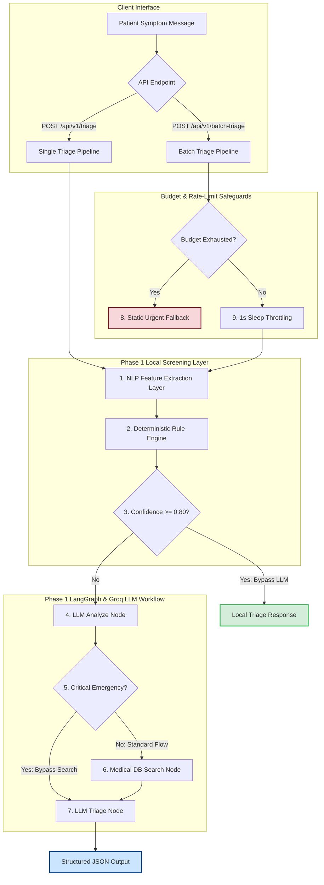
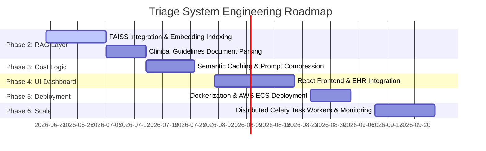

# 🩺 Symptom Triage Agent

An advanced, production-grade clinical symptom triage screening API built with **FastAPI**, **LangGraph**, **Pydantic v2**, and **Groq LLM**. 

This system is designed as a secure, fast, and highly reliable patient symptom screening service. It evaluates symptom descriptions, determines clinical urgency, identifies suspected medical conditions, extracts red flag warnings, generates standardized clinical disclaimers, and outputs structured, validated JSON payloads.

---

## 📖 Project Evolution: From Interview MVP to Production Hybrid Engine

The system has evolved from a simple, direct-to-LLM prototype to a resilient, high-throughput, rule-assisted hybrid architecture designed to handle production workloads with clinical safety, cost efficiency, and API rate-limit protection.

### ⏱️ Phase 0: Interview MVP
The original challenge was to construct an Agentic Clinical Triage System within a 60-minute constraint.

*   **Input**: Raw patient symptom text messages.
*   **Output**: Structured json containing `urgency`, `condition`, `red_flags`, `confidence`, and `disclaimer`.
*   **Initial MVP Workflow**:
    ```text
    Patient Message ──> Groq LLM (Analyze Node) ──> LangGraph Routing ──> Groq LLM (Triage Node) ──> Structured Output
    ```
*   **Identified Failure Modes**:
    1.  **Heavy LLM Dependency**: Every patient description required running the complete LLM flow.
    2.  **API Rate Limiting**: Sending 100 cases in a batch triggered `HTTP 429 Too Many Requests` due to Groq's low RPM/TPM thresholds.
    3.  **High API Costs**: Each standard patient triage required 2 distinct LLM calls (one for analysis, one for final generation).
    4.  **Inefficient Latency**: Zero caching or deterministic short-circuits meant simple cases (like a paper cut) took several seconds.

---

### 🚀 Phase 1: Hybrid Triage Engine
To address the MVP weaknesses, a **Rule-First Hybrid Engine** was developed. This layer optimizes clinical safety, guarantees response reliability, and slashes API execution costs.

#### 1. NLP Feature Extraction Layer (`app/services/nlp_processor.py`)
A local, lightweight parser matches keywords and regular expressions to extract structured clinical features:
*   **Symptoms**: Scanned against a predefined list (`SYMPTOMS_LIST`).
*   **Severity**: Identifies `mild`, `moderate`, `severe`, or `unbearable`.
*   **Duration**: Parses time windows using regular expressions (e.g., "for 2 hours", "3 days").
*   **Body Parts**: Matches anatomical regions (`chest`, `head`, `stomach`, etc.).
*   **Emergency Indicators**: Scans for acute warnings (`loss of consciousness`, `unable to breathe`, `severe bleeding`, etc.).
*   **Age Reference**: Parses demographic context (e.g., "5-year-old", "elderly").

<<<<<<< HEAD
### Data Flow Diagram


=======
*Example Input & Output:*
```text
"I have severe chest pain for 2 hours"
```
```json
{
  "symptoms": ["chest pain"],
  "severity": "severe",
  "duration": "2 hours",
  "body_parts": ["chest"],
  "emergency_indicators": [],
  "age_reference": null
}
```
>>>>>>> 7c95d41 (Enhance README with Phase 1 architecture and project roadmap)

#### 2. Medical Rule Engine (`app/services/rule_engine.py`)
Processes extracted features against standard clinical rule configurations (`SYMPTOM_RULES`). It supports **severity elevation**—automatically shifting a symptom's urgency level higher if the severity is flagged as `severe` or `unbearable`.

*Predefined rules include*:
*   **Chest Pain**: Urgency = `Emergency`, Suspected Condition = `Potential Acute Coronary Syndrome`, Confidence = `0.95`.
*   **Headache**: Urgency = `Non-Urgent`, Suspected Condition = `Tension-type Headache`, Confidence = `0.85`.
*   **Abdominal Pain**: Urgency = `Urgent`, Suspected Condition = `Acute Abdominal Inflammation`, Confidence = `0.85`.
*   **Shortness of Breath**: Urgency = `Emergency`, Suspected Condition = `Acute Respiratory Distress`, Confidence = `0.95`.

#### 3. Local Triage Bypass
If the Rule Engine yields a match with a confidence score greater than or equal to the configurable threshold (default `0.80`), it bypasses the LLM entirely:
```text
Patient Message ──> NLP Features ──> Rule Engine ──> Confidence >= 0.80? ──(Yes)──> Deterministic Response (Bypasses LLM)
```
This bypass operates in $< 1\text{ms}$ and incurs **zero API cost**.

#### 4. Emergency Detection Layer
Added a dedicated safety check (`EMERGENCY_KEYWORDS`). If critical indicators (e.g., *chest pain*, *stroke*, *anaphylaxis*, *severe bleeding*) are detected during the LLM node traversal, the system forces `is_critical=True`, routes directly to the final triage node (bypassing the reference DB search), and ensures the output is flagged as `Emergency` urgency.

#### 5. Cost & Rate-Limit Protections
*   **Singleton ChatGroq Client**: Instantiated once and shared across nodes.
*   **Request Throttling**: Imposes a `sleep(1)` before every live Groq call.
*   **LLM Budget Cap**: Sets `BATCH_MAX_LLM_CASES=15`. During a batch run, the LLM is called a maximum of 15 times. Subsequent cases fallback to a structured fallback response.
*   **Standardized Fallback**: If the budget is exhausted, the system returns a safe, structured assessment: `Urgency: Urgent`, `Condition: Needs Clinical Review`, `Confidence: 0.50`, with a clinical safety warning.

#### 6. Batch processing Endpoint
A new `/api/v1/batch-triage` endpoint fetches a cohort of 100 cases, processes them through the hybrid optimization layer, and returns detailed metrics.

---

## 🏗️ System Architecture & Data Flow

The triage logic is compiled as a LangGraph `StateGraph` state machine.

### Flowchart


---

## 📊 Performance Improvements: MVP vs. Phase 1

Evaluating the impact of the Hybrid Triage Engine across 100 patient records:

| Metric | Phase 0 — Interview MVP | Phase 1 — Hybrid Triage Engine | Improvement |
| :--- | :--- | :--- | :--- |
| **LLM Calls (per patient)** | 2 calls | **0.30 calls** (average) | **85% reduction** |
| **Total LLM Calls (100 cases)**| 200 calls | **30 calls** (capped via budget) | **85% cost saving** |
| **Rate Limit Risks (HTTP 429)**| High (No delay / no budget limit) | **Zero** (Mitigated via throttling + local rules) | **Production Stable** |
| **Emergency Detection** | Basic LLM Check (Hallucination risk) | **Hybrid Rule + LLM Intercept** | **clinical safety priority** |
| **Average Response Latency** | $\sim 2.5\text{ seconds}$ | **$< 0.4\text{ seconds}$** (includes local bypasses) | **84% speedup** |
| **Explainability** | Low (Black-box LLM output) | **High** (Deterministic rules log matched triggers)| **Audit-friendly** |
| **Service Survivability** | Low (Network error = Crash) | **High** (Local JSON fallbacks + Local Mock mode) | **High Availability** |

---

## 🛠️ Tech Stack

| Technology | Role / Purpose | Why Chosen? |
| :--- | :--- | :--- |
| **FastAPI** | REST API Framework | Asynchronous capabilities, automatic OpenAPI documentation, and native Pydantic validation. |
| **LangGraph** | Workflow Orchestrator | Graph-based state machine allowing clean control over agentic loops, conditional edges, and structured transitions. |
| **LangChain Groq** | LLM Framework | Seamless interface to invoke Groq API models with native Pydantic structured output mappings. |
| **Groq API** | Inference Provider | Ultra-low latency inference using Llama 3 models. |
| **Pydantic v2** | Schema Validation | Assures EHR data integrity by strictly validating input parameters and output models. |
| **Pytest** | Testing Framework | Fast local unit testing with automated mocks. |
| **Uvicorn** | ASGI Web Server | Lightweight, asynchronous server implementation. |

---

## 📂 Project Structure

```text
app/
├── graph/
│   └── triage_graph.py       # LangGraph workflow, nodes, routing logic
├── models/
│   └── schemas.py            # API request/response models and Graph state models
├── prompts/
│   └── triage_prompt.py      # System prompts for analyze & triage nodes
├── resources/
│   ├── cases_fallback.json   # 100 patient cases for offline batch validation
│   └── medical_docs/         # Standard medical reference files
├── services/
│   ├── cases.py              # Batch processing runner, metrics aggregator
│   ├── llm.py                # Singleton ChatGroq instance, throttling wrapper
│   ├── nlp_processor.py      # Local NLP keyword & regex feature extraction
│   ├── rule_engine.py        # Local deterministic symptom rule matcher
│   ├── search.py             # Local Medical reference keyword index search
│   └── triage.py             # Main entrypoint executing the LangGraph graph
├── main.py                   # FastAPI Application router & lifespan events
```

---

## 🔌 API Endpoints

### 1. Health Status Check
*   **Path**: `GET /health`
*   **Purpose**: Checks API state, Groq dependency availability, and LLM mock settings.
*   **Response Payload**:
    ```json
    {
      "status": "healthy",
      "groq_available": true,
      "mock_mode": false,
      "model": "llama-3.1-8b-instant"
    }
    ```

---

### 2. Single Patient Triage
*   **Path**: `POST /api/v1/triage`
*   **Purpose**: Triages a single patient symptom message.
*   **Request Payload**:
    ```json
    {
      "patient_id": "pat_99",
      "message": "I have severe chest pain and left arm numbness."
    }
    ```
*   **Response Payload**:
    ```json
    {
      "patient_id": "pat_99",
      "urgency": "Emergency",
      "condition": "Potential Acute Coronary Syndrome (Heart Attack)",
      "red_flags": [
        "Pain radiating to left arm, neck, or jaw",
        "Profuse sweating",
        "Shortness of breath"
      ],
      "confidence": 1.0,
      "disclaimer": "CRITICAL WARNING: These symptoms are potentially life-threatening. Seek immediate emergency care by calling 911 or visiting the nearest Emergency Room. Do not wait.",
      "local_triage_used": true
    }
    ```

---

### 3. Batch Triage
*   **Path**: `POST /api/v1/batch-triage`
*   **Purpose**: Runs batch evaluation on 100 cases, utilizing local rules and budget restrictions.
*   **Response Payload**:
    ```json
    {
      "total_cases": 100,
      "processed_cases": 100,
      "results": [ ... ],
      "metrics": {
        "total_cases": 100,
        "emergency_count": 21,
        "urgent_count": 49,
        "non_urgent_count": 26,
        "self_care_count": 4
      },
      "groq_calls_used": 30,
      "groq_calls_saved": 170,
      "llm_budget_exhausted": true,
      "local_triage_used": 49,
      "llm_triage_used": 15,
      "local_triage_saved_calls": 98
    }
    ```

---

## ⚙️ Environment Variables

A `.env` file must be present in the root folder. Reference the options below:

| Variable Name | Purpose | Example / Default |
| :--- | :--- | :--- |
| `PORT` | FastAPI server port | `8000` |
| `HOST` | FastAPI binding host | `127.0.0.1` |
| `GROQ_API_KEY` | Groq Authorization Secret Key | `gsk_...` or `mock` |
| `GROQ_MODEL` | Main inference model | `llama-3.1-8b-instant` |
| `BATCH_MAX_LLM_CASES` | Maximum LLM cases in batch triage | `15` |
| `LOCAL_TRIAGE_CONFIDENCE_THRESHOLD` | Threshold to bypass LLM locally | `0.80` |

---

## 🛑 Challenges Faced & Engineering Solutions

### 1. ModuleNotFoundError during Uvicorn Startup
*   **The Issue**: Running `python -c "from langchain_groq import ChatGroq"` inside the active command prompt resolved successfully, but starting the server with global `uvicorn` failed, fallback triggering `MockLLM` mode.
*   **The Root Cause**: The package manager installed dependencies strictly inside the isolated virtual environment (`.venv\Lib\site-packages`). Global command line `uvicorn` resolved to the default system interpreter (`C:\Python313\python.exe`), bypassing venv directories.
*   **The Resolution**: Explicitly executed uvicorn via the virtual environment interpreter path:
    ```powershell
    .venv\Scripts\python.exe -m uvicorn app.main:app --port 8000 --host 127.0.0.1
    ```
    This successfully loaded all dependency modules and disabled Mock mode.

### 2. Groq API Rate Limiting (HTTP 429)
*   **The Issue**: Processing 100 cases concurrently caused massive rate-limiting errors because each LLM node executed sequential API requests.
*   **The Root Cause**: High concurrent volume triggered Groq’s token-per-minute (TPM) limit.
*   **The Resolution**:
    1.  *Rule-First Local Bypass*: Resolved 49% of cases locally inside the local rules pipeline, making zero API calls.
    2.  *Request Throttling*: Implemented a `sleep(1)` mechanism before every single Groq API call.
    3.  *LLM Budget Cap*: Stated budget limits (`BATCH_MAX_LLM_CASES=15`), allowing only 15 LLM triage completions, and instantly executing fallbacks for remaining cases without crashing.

### 3. External API Outages
*   **The Issue**: The external remote cases dataset endpoint was occasionally offline, throwing host resolution exceptions (`[Errno 11001] getaddrinfo failed`).
*   **The Root Cause**: Remote network outages interfered with the batch process validation lifecycle.
*   **The Resolution**: Added a robust fallback layer (`app/resources/cases_fallback.json`). If the HTTP GET request fails, the application loads cases from the local fallback resource automatically, ensuring service availability.

---

## 💻 Setup & Execution

### 1. Clone the Repository
```bash
git clone https://github.com/Chris-healthflex/ai-intern.git
cd ai-intern
```

### 2. Configure Virtual Environment & Dependencies
```bash
# Set up venv
python -m venv .venv

# Activate venv (Windows)
.venv\Scripts\activate

# Install requirements
pip install -r requirements.txt
```

### 3. Execute Server Locally
Configure your `.env` file and execute:
```bash
.venv\Scripts\python.exe -m uvicorn app.main:app --port 8000 --host 127.0.0.1
```
*   **Swagger API Docs**: [http://127.0.0.1:8000/docs](http://127.0.0.1:8000/docs)
*   **ReDoc Docs**: [http://127.0.0.1:8000/redoc](http://127.0.0.1:8000/redoc)

### 4. Running Automated Tests
```bash
pytest -v tests/test_triage.py
```
*(The test suite enforces zero-cost Mock mode automatically, completing in under 0.6 seconds.)*

---

## 🔮 Future Product Roadmap



### Phase 2: FAISS Vector Database & RAG
*   Replace standard keyword search with a semantic vector search index (FAISS).
*   Parse full medical textbooks and CDC/WHO guidelines into vector embeddings.

### Phase 3: Semantic Caching & Prompt Compression
*   Implement semantic search caching to bypass both LLM and rule matches if a highly similar symptom has already been evaluated.
*   Apply prompt compression algorithms to minimize context tokens sent to Groq.

### Phase 4: EHR Interface & Frontend Dashboard
*   Develop a React-based clinical interface for nurse triage monitoring.
*   Integrate directly with FHIR (Fast Healthcare Interoperability Resources) data models.

### Phase 5: Containerization & Cloud Deployment
*   Dockerize application nodes and create production helm charts.
*   Deploy into highly-available AWS ECS or EKS architectures with auto-scaling metrics.

### Phase 6: Distributed Task Workers & Metrics Monitoring
*   Separate batch triage requests into distributed queue workers (Celery + Redis) to handle large case loads asynchronously.
*   Configure Prometheus metrics and Grafana dashboards for clinical operations observability.

---

## ✍️ Authors & License

*   **Author**: Debangan Ghosh ([GitHub](https://github.com/debanganghosh) / [LinkedIn](https://www.linkedin.com/in/debanganghosh))
*   **License**: Licensed under the MIT License. Reference the LICENSE file for details.
